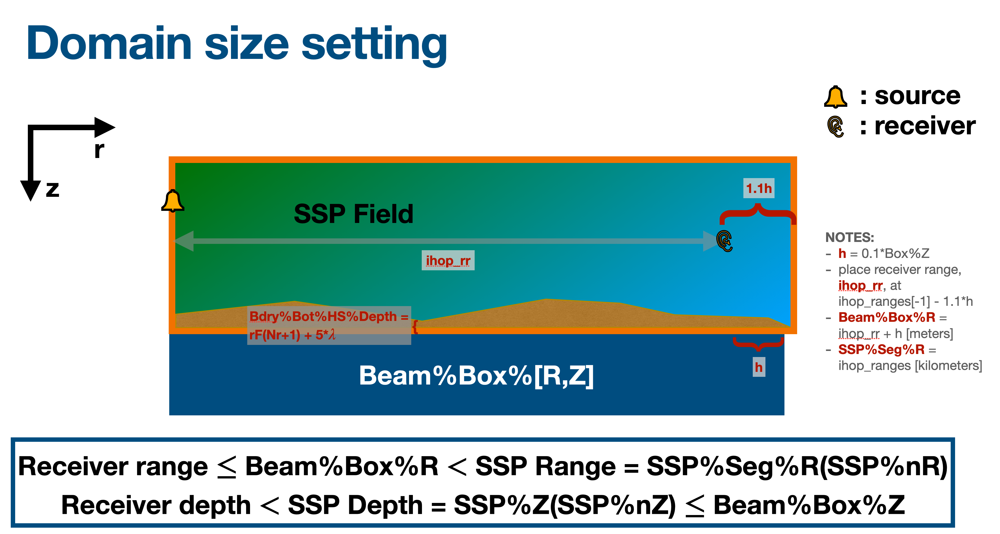

# iHOP: Underwater acoustics for MITgcm

`ihop` is a *new* physics package in [MITgcm](https://mitgcm.readthedocs.io/en/latest/getting_started/getting_started.html), allowing for simulations to investigate underwater acoustics. This code, based in Modern Fortran, is a ray-trace simulation of sound propagation.

The package interacts with the MITgcm kernel during initialisation, time-stepping, and in post-processing.

Development is up to date with [MITgcm `checkpoint69f`](https://github.com/MITgcm/MITgcm/commit/214bfe91bf8caee3cf215213baad672483c85b49)

## How-to use
MITgcm code modifications are saved in [ihop/mitgcm_code](mitgcm_code):
- adds `useIHOP` to `PARAMS.h`
- inserts `pkg/ihop` in `forward_step.F`
- allows for `SVEL` and `SLD` as GCM diagnostics using `pkg/diagnostics` with optional `pkg/mnc`
- opens `pkg/ihop` for inclusion in **TAF** TL and AD models, can be used with and without `pkg/ecco`

`ihop` is dependent on the following packages:
- `cal` for storing times of sound transmissions
- `cost` for aggregation of acoustic cost function contributions

## Tips

#### Create ihop domain
For input, you will be asked to generate range points along a 2D plane between 
a source and receiver. The number of range points can vary from 2 to N, and is saved in `ihop_ranges`. The position of a receiver _must_ be contained within the ranges specified, see image below for context. At ray fan initialisation, the tracing step size is 10% the maximum ocean depth defined in your `.bty` file.



# TO-DO
- [ ] DOC: create minimal documentation to help user get started with MITgcm+ihop
- [ ] PYTHON: add simple input file generation
- [ ] FORTRAN77: add simple verification problem
- [ ] PYTHON: add synthetic observation data file generation

# Citing
```
@software{ihop,
    author={Ivana Escobar},
    title = {{ihop}: Underwater Acoustics for MITgcm},
    version = {0.4},
    year = {2025},
    url = {https://github.com/IvanaEscobar/ihop/tree/v0.4}
}
```
